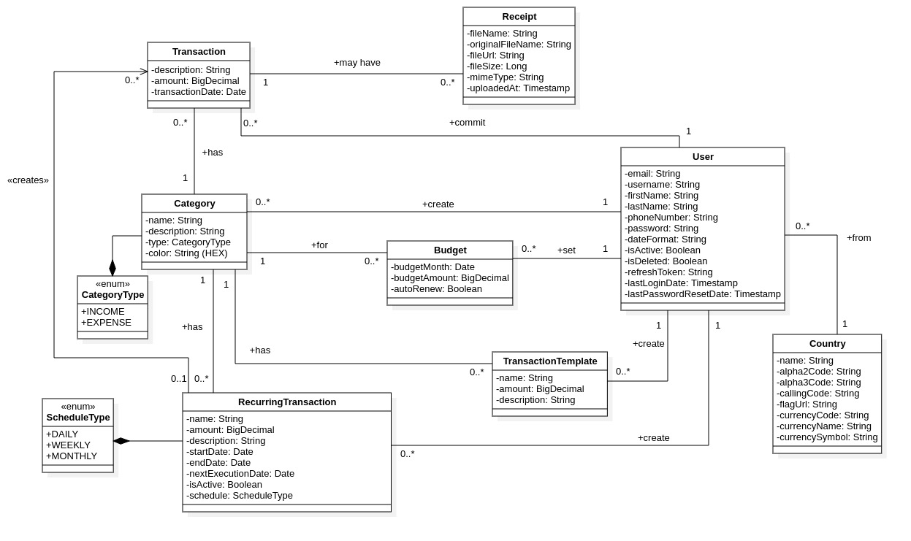

# BudgetWise+ 💰
### Smart Personal Finance Tracker


---

## 📖 Table of Contents
- [Project Overview](#-project-overview)
- [Features](#-features)
- [Tech Stack](#-tech-stack)
- [Architecture](#-architecture)
- [Getting Started](#-getting-started)
- [API Documentation](#-api-documentation)
- [Contributing](#-contributing)
- [Team](#-team)
- [License](#-license)

---

## 🚀 Project Overview

**BudgetWise+** is a modern, full-stack web application designed to help users take control of their personal finances. Track income and expenses, categorize transactions, set budgets, and visualize financial trends with beautiful, interactive charts.

### 🎯 One-liner
*A sleek, full-stack web app to track income and expenses, categorize transactions, set budgets, and visualize financial trends — powered by Spring Boot and React.*

### 🏆 ALX SE Portfolio Project
This project represents the culmination of the ALX Software Engineering Webstack specialization, demonstrating proficiency in:
- Full-stack web development
- RESTful API design and implementation
- Database design and management
- User authentication and security
- Modern frontend frameworks
- Third-party API integration

**Project Timeline:** June 27 - July 10, 2025  
**Team:** Otmane Touhami

---

## ✨ Features

### 🔑 Core Features (MVP)
- **👤 User Authentication**: Secure JWT-based login and registration system
- **💰 Transaction Management**: Complete CRUD operations for income and expense tracking
- **📂 Category Management**: Custom category creation and management
- **📊 Interactive Dashboard**: Real-time financial overview with visual analytics
- **📅 Smart Filtering**: Filter transactions by date ranges (today, week, month, custom)
- **📤 Data Export**: Export transaction history to CSV format

### 🌟 Advanced Features (Stretch Goals)
- **💸 Budget Alerts**: Smart notifications when approaching spending limits
- **🧾 Receipt Upload**: Image upload and storage for transaction receipts
- **📱 SMS Notifications**: Real-time alerts via Twilio integration
- **📈 Trend Analysis**: Historical spending patterns and insights
- **🎨 Responsive Design**: Seamless experience across all devices

---

## 🛠 Tech Stack

### Backend
- **Framework**: Spring Boot 3.x
- **Security**: Spring Security + JWT Authentication
- **Database**: Spring Data JPA + Hibernate + MySQL
- **Documentation**: Swagger/OpenAPI
- **File Storage**: Local/AWS S3 for receipt uploads
- **Notifications**: Twilio API for SMS alerts

### Frontend
- **Framework**: React 19
- **Routing**: React Router DOM
- **State Management**: Context API / Redux Toolkit
- **HTTP Client**: Axios
- **Charts**: Chart.js / Recharts
- **Styling**: CSS3 + Responsive Design
- **Build Tool**: Vite

### DevOps & Tools
- **Version Control**: Git & GitHub
- **Database**: MySQL 8.0
- **API Testing**: Postman
- **Development**: VS Code - intellij IDE

---

## 🏗 Architecture

### System Design
Our application follows a clean, layered architecture pattern:

#### Backend Architecture
```
├── Controller Layer (REST APIs)
├── Service Layer (Business Logic)
├── Repository Layer (Data Access)
└── Entity Layer (Data Models)
```

#### Database Schema


*The class diagram above illustrates our database design, showing relationships between Users, Transactions, Categories, Budgets, and supporting entities.*

### Key Entities
- **User**: Authentication and profile management
- **Transaction**: Income and expense records with categorization
- **Category**: User-defined spending categories
- **Budget**: Monthly spending limits per category
- **Receipt**: Optional transaction receipt storage
- **RecurringTransaction**: Automated recurring transactions

---

## 🚀 Getting Started

### Prerequisites
- **Java 17+**
- **Node.js 16+**
- **MySQL 8.0**
- **Maven 3.6+**

### Installation

1. **Clone the repository**
   ```bash
   git clone https://github.com/OtmaneTouhami/budget-wise.git
   cd budget-wise
   ```

2. **Backend Setup**
   ```bash
   cd api
   mvn clean install
   # Configure database in application.properties
   mvn spring-boot:run
   ```

3. **Frontend Setup**
   ```bash
   cd frontend
   npm install
   npm run dev
   ```

4. **Database Setup**
   ```sql
   CREATE DATABASE budgetwise;
   -- Tables will be auto-created via JPA
   ```

### Environment Variables
Create `.env` files in both backend and frontend directories:

**Backend (.env)**
```
DB_URL=jdbc:mysql://localhost:3306/budgetwise
DB_USERNAME=your_username
DB_PASSWORD=your_password
JWT_SECRET=your_jwt_secret_key
TWILIO_ACCOUNT_SID=your_twilio_sid
TWILIO_AUTH_TOKEN=your_twilio_token
```

**Frontend (.env)**
```
VITE_API_BASE_URL=http://localhost:8080/api
```

---

## 📋 API Documentation

### Authentication Endpoints
- `POST /api/auth/register` - User registration
- `POST /api/auth/login` - User login
- `POST /api/auth/refresh` - Refresh JWT token

### Transaction Endpoints
- `GET /api/transactions` - Get all transactions (with filtering)
- `POST /api/transactions` - Create new transaction
- `PUT /api/transactions/{id}` - Update transaction
- `DELETE /api/transactions/{id}` - Delete transaction
- `GET /api/transactions/export` - Export to CSV

### Category Endpoints
- `GET /api/categories` - Get all categories
- `POST /api/categories` - Create new category
- `PUT /api/categories/{id}` - Update category
- `DELETE /api/categories/{id}` - Delete category

### Budget Endpoints
- `GET /api/budgets` - Get all budgets
- `POST /api/budgets` - Create/update budget
- `GET /api/budgets/alerts` - Get budget alerts

*Full API documentation available at `/swagger-ui.html` when running the backend*

---

## 🎯 Learning Objectives

This project demonstrates mastery of:

✅ **Backend Development**
- RESTful API design and implementation
- JWT authentication and authorization
- Database design and ORM usage
- File upload and storage
- Third-party API integration

✅ **Frontend Development**
- Modern React development patterns
- State management and component architecture
- Responsive design principles
- Data visualization and charting
- Form handling and validation

✅ **Full-Stack Integration**
- Frontend-backend communication
- Error handling and user feedback
- Security best practices
- Performance optimization

✅ **Project Management**
- Agile development methodology
- Version control with Git
- Documentation and code organization
- Testing and debugging

---

## 🗓 Development Schedule

| Phase | Duration | Tasks |
|-------|----------|-------|
| **Setup & Auth** | Days 1-2 | Project setup, JWT authentication |
| **Core CRUD** | Days 3-4 | Transaction and category APIs |
| **Frontend CRUD** | Days 5-6 | React components and forms |
| **Dashboard** | Days 7-8 | Charts and data visualization |
| **Filtering & Export** | Days 9-10 | Date filters and CSV export |
| **Advanced Features** | Days 11-12 | Budget alerts, file upload |
| **Polish & Deploy** | Days 13-14 | Testing, bug fixes, deployment |

---

## 🤝 Contributing

1. Fork the repository
2. Create a feature branch (`git checkout -b feature/AmazingFeature`)
3. Commit your changes (`git commit -m 'Add some AmazingFeature'`)
4. Push to the branch (`git push origin feature/AmazingFeature`)
5. Open a Pull Request

---

## 👨‍💻 Team

**Otmane Touhami**
- GitHub: [@OtmaneTouhami](https://github.com/OtmaneTouhami)
- Email: otmanetouhami.dev@gmail.com
- LinkedIn: [Otmane Touhami](https://linkedin.com/in/otmane-touhami)

*ALX Software Engineering Student*

---

## 🚧 Current Status

**Phase**: Initial Development  
**Completed**: Project setup, architecture design, database schema  
**In Progress**: Backend API implementation  
**Next**: Frontend React components  

---

## 📝 License

This project is licensed under the MIT License - see the [LICENSE](LICENSE) file for details.

---

## 🙏 Acknowledgments

- **ALX Africa** - For the comprehensive software engineering program
- **The ALX SE Community** - For continuous support and collaboration
- **Open Source Libraries** - For the amazing tools that make this project possible

---

**Made with ❤️ as part of the ALX SE Webstack Portfolio Project**
